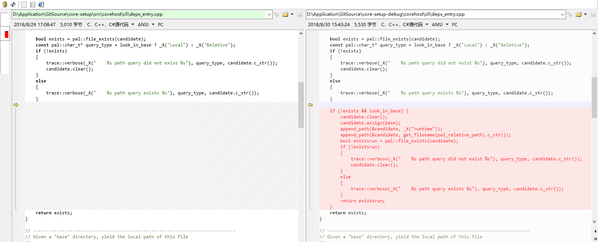

# core-setup-debug
SCD模式下发布后支持大部分dll放在runtime文件夹下

更新到2.1.3
更改corehost\cli\deps_entry.cpp代码 

这个文件Microsoft.Extensions.DependencyModel.dll已经不需要替换了，原始版本已经支持了
紧紧替换hostpolicy.dll文件即可

2.0.0版本
更改前

更改后

<a href="https://www.cnblogs.com/xakep/articles/7751273.html">如何编译调试hostpolicy.dll文件，请点击这里</a>
